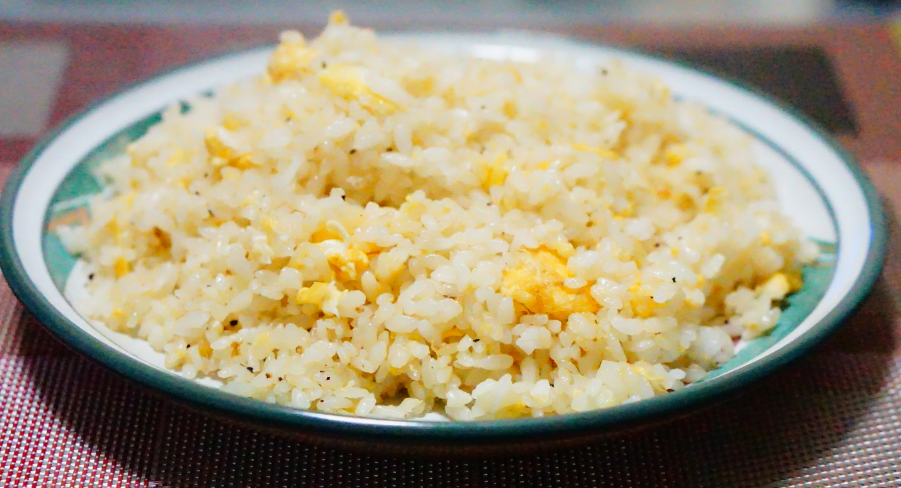

# レシピまとめ

## 卵チャーハン
<!--  -->

【材料】
- ご飯          1.5合
- 卵            2個
- ネギ          1/2本
- 中華あじ      小1.5
- 塩            少々
- 胡椒          少々

【工程】
1. ご飯に卵をからめておく
2. サラダ油を熱し、1.を入れて炒める
3. ネギを入れて中華あじ・塩・胡椒で味を調える

