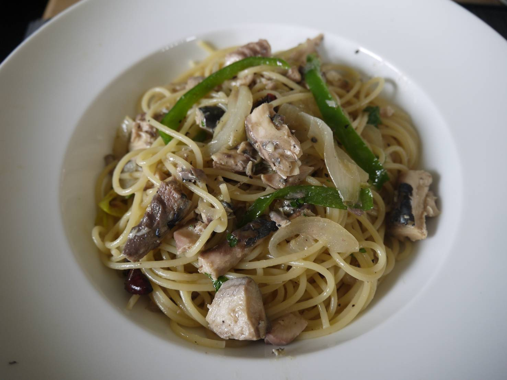

# リスト

- ### 飯

    <!-- - [卵チャーハン](#卵チャーハン) -->
    - [ガパオライス](#ガパオライス)
    - [焼きサバ丼](#焼きサバ丼)
    - [石焼ビビンバ](#石焼ビビンバ)
    - [かにかまレタスあんかけチャーハン](#かにかまレタスあんかけチャーハン)

- ### 麺

    - [サバのパスタ](#サバのパスタ)
    - [ツナとアンチョビのトマトパスタ](#ツナとアンチョビのトマトパスタ)
    - [明太子と大葉のバター醤油パスタ](#明太子と大葉のバター醤油パスタ)

- ### 豚肉

    - [豚ばら肉と青じそのロール巻き](#豚ばら肉と青じそのロール巻き)
    - [肉団子の黒酢あんかけ](#肉団子の黒酢あんかけ)

- ### 鶏肉

    - [鶏と野菜の黒酢あん](#鶏と野菜の黒酢あん)
    - [鶏の照り焼きステーキ](#鶏の照り焼きステーキ)
    - [ささみときゅうりの中華風ごま酢サラダ](#ささみときゅうりの中華風ごま酢サラダ)

- ### サラダ
    <!-- - [ヨーグルトソースのポテトサラダ](#ヨーグルトソースのポテトサラダ) -->

- ### スープ

    - [中華風わかめスープ](#中華風わかめスープ)
    - [ビシソワーズ](#ビシソワーズ)

<!-- ---

## 卵チャーハン

【材料】
- ご飯　　　　　　　　　　1.5合
- 卵　　　　　　　　　　　2個
- ネギ　　　　　　　　　　1/2本
- 中華あじ　　　　　　　　小1.5
- 塩　　　　　　　　　　　少々
- 胡椒　　　　　　　　　　少々

【工程】
1. ご飯に卵をからめておく
2. サラダ油を熱し、1.を入れて炒める
3. ネギを入れて中華あじ・塩・胡椒で味を調える

[リストに戻る](#リスト) -->

---

## かにかまレタスあんかけチャーハン

【材料】
- ご飯　　　　　　　　　　1.5合
- 卵　　　　　　　　　　　2個
- しょうが　　　　　　　　1/4片
- ネギ　　　　　　　　　　1/2本
- レタス　　　　　　　　　4-5枚
- かにかま　　　　　　　　8本
- 塩　　　　　　　　　　　少々
- 胡椒　　　　　　　　　　少々
- ごま油　　　　　　　　　小1

  ■スープ[A]
    - 水　　　　　　　　　360cc
    - 鶏ガラスープの素　　小2
    - 醤油　　　　　　　　小1/2
    - 砂糖　　　　　　　　小1/2

  ■水溶き片栗粉[B]
    - 水　　　　　　　　　大2
    - 片栗粉　　　　　　　大1

【工程】
1. レタスは一口大にちぎり、かにかまは細く裂いておく
2. しょうがはみじん切り、ネギは小口切りにして、卵は溶きほぐしておき、スープの材料を混ぜ合わせておく
3. フライパンでサラダ油を熱し、煙が立つくらい熱くなったら卵を入れ、すぐにご飯も加える
4. 卵を絡めながら木べらでご飯を切るようにして炒めていく
5. 塩・胡椒・ネギを加え、軽く混ぜ合わせたら器に盛る
6. 同じフライパンにごま油を熱し、しょうがを炒め、香りが立ったらかにかまを加える
7. さっと炒めたらレタスを加え、火が通り過ぎる前に(軽くしんなりしたら)、[A]のスープを加え、[B]の水溶き片栗粉を加える
8. とろみがついたら器に盛ったご飯にかける

[リストに戻る](#リスト)

---

## 豚ばら肉と青じそのロール巻き

【材料】
- 豚ばら肉　　　　　　　　　10枚
- しょうが　　　　　　　　　1片
- にんにく　　　　　　　　　1片
- 塩　　　　　　　　　　　　少々
- 胡椒　　　　　　　　　　　少々
- 青じそ　　　　　　　　　　15枚
- 片栗粉　　　　　　　　　　適量
- すりごま　　　　　　　　　少々

  ■合わせ調味料
    - 醤油　　　　　　　　大2
    - 酒　　　　　　　　　大2
    - みりん　　　　　　　大2
    - 砂糖　　　　　　　　大1
    - だし汁　　　　　　　大3

【工程】
1. 豚肉を2枚ずつ重ねて広げ、おろししょうがとおろしにんにくを塗る
2. 塩・胡椒をして、青じそを3枚ずつ乗せながらしっかりと巻く
3. 表面に片栗粉を振り、しっかりと握っておく
4. サラダ油を中火で熱し、転がしながら全面をこんがりと焼く
5. 合わせ調味料を加えてからめ、弱火にして蓋をして1-2分ほど蒸し焼きにする
6. お皿に千切りにしたキャベツをお好みで敷き、盛り付け、フライパンに残ったたれをかけ、最後にすりごまをふる

[リストに戻る](#リスト)

<!-- ---

## ヨーグルトソースのポテトサラダ

【材料】
- じゃがいも　　　　　　　　　5個
- ブラックオリーブ　　　　　　お好み

  ■ソース
    - マヨネーズ　　　　　　適量
    - おろしにんにく　　　　1片
    - ヨーグルト　　　　　　適量
    - 刻みパセリ　　　　　　適量
    - 塩　　　　　　　　　　少々
    - 胡椒　　　　　　　　　少々
    - レモン　　　　　　　　1/2個分
    - オリーブオイル　　　　適量

【工程】
1. じゃがいもを半分に切り、柔らかくなるまで茹でる（20分ほど）
2. 1.にソースをからめ、ブラックオリーブをお好みで加える
3. 最後にオリーブオイルを掛け、レモンの皮を削る

[リストに戻る](#リスト) -->

---

## サバのパスタ

【材料】
- サバの水煮缶　　　　　　　　　1缶
- 玉ねぎ　　　　　　　　　　　　中1個
- ピーマン　　　　　　　　　　　2個
- 鷹の爪　　　　　　　　　　　　1つ
- にんにく　　　　　　　　　　　1片
- 塩　　　　　　　　　　　　　　少々
- 胡椒　　　　　　　　　　　　　少々
- 醤油　　　　　　　　　　　　　大1
- 刻みパセリ　　　　　　　　　　適量

【工程】
1. パスタ用のお湯を沸かし、塩を10%程度を目安に入れ(分量外)、麺を茹でる(1.7mmで7分ほど)
2. にんにくを薄くスライスし、オリーブオイルで鷹の爪と共に炒めて油に香りを移す
3. 薄くスライスした玉ねぎを加え、弱中火でじっくり炒める
4. 玉ねぎの色が透き通ってきたら1cm幅で切ったピーマンを加え、さらに火を通す
5. ピーマンにも火が通ってきたらサバ缶を入れ、塩・胡椒・醤油で味を調える
6. 麺が茹であがったら、ソースに絡めお皿に盛る
7. 上からパセリを散らす　※お好みで大根おろし・大葉・ポン酢をかけてもGood

[リストに戻る](#リスト)

---

## ツナとアンチョビのトマトパスタ

【材料】
- 鷹の爪　　　　　　　　　　　1つ
- にんにく　　　　　　　　　　1片
- 玉ねぎ　　　　　　　　　　　1個
- パンチェッタ　　　　　　　　適量
- アンチョビ　　　　　　　　　1枚
- ツナ缶　　　　　　　　　　　1缶
- トマト缶　　　　　　　　　　1缶
- コンソメ　　　　　　　　　　1つ
- 白ワイン　　　　　　　　　　少々
- ハーブ　　　　　　　　　　　1枚
- 砂糖　　　　　　　　　　　　小1.5
- 塩　　　　　　　　　　　　　少々
- 胡椒　　　　　　　　　　　　少々
- 刻みパセリ　　　　　　　　　適量
- パルミジャーノ　　　　　　　適量

【工程】
1. パスタ用のお湯を沸かし、塩を10%程度を目安に入れ(分量外)、麺を茹でる(1.7mmで7分ほど)
2. にんにくを薄くスライスし、オリーブオイルで鷹の爪と共に炒めて油に香りを移す
3. 薄くスライスした玉ねぎを加え、甘みを出すために弱中火でじっくり炒める
4. 玉ねぎの色が透き通ってきたら薄切りにしたパンチェッタと1cm幅で切ったアンチョビを加え、ツナ缶・トマト缶を加えてさらに炒める
5. コンソメを溶かし、白ワインを加えたら10-20秒程火を強くして飛ばしたのち中火に戻す
6. ハーブ(月桂樹)・砂糖・塩・胡椒を加えて味を調える
7. 麺が茹であがったら、麺の煮汁を入れてのばしつつ麺を絡めてお皿に盛る
8. 上からパセリと削ったパルミジャーノを散らす

[リストに戻る](#リスト)

---

## 明太子と大葉のバター醤油パスタ

【材料】
- 大葉　　　　　　　　　　　　4枚
- 刻み海苔　　　　　　　　　　少量

  ■ソース[A]
    - 明太子　　　　　　　　　2腹(60g程度)
    - バター　　　　　　　　　10g
    - オリーブオイル　　　　　小2
    - めんつゆ　　　　　　　　小2

【工程】
1. パスタ用のお湯を沸かし、塩を10%程度を目安に入れ(分量外)、麺を茹でる(1.7mmで7分ほど)
2. 明太子の真ん中に包丁で切り込みを入れて開き、薄皮から取り出す
3. 大葉を千切りにする
4. パスタが茹であがったらザルに上げて水気を切り、茹でた鍋に戻して[A]を加えてよく混ぜ合わせる
5. 器に盛り付け、大葉・刻み海苔を散らす

[リストに戻る](#リスト)

---

## ガパオライス

【材料】

- 鶏挽き肉　　　　　　　　　　200g
- 赤パプリカ　　　　　　　　　1/4個
- 黄パプリカ　　　　　　　　　1/4個
- ピーマン　　　　　　　　　　2個
- 玉ねぎ　　　　　　　　　　　1/2個
- バジル　　　　　　　　　　　4枚
- ニンニク　　　　　　　　　　1片
- 豆板醤　　　　　　　　　　　小1

  ■合わせ調味料[A]
    - ナンプラー　　　　　　小2
    - オイスターソース　　　小2
    - 酒　　　　　　　　　　大1
    - 砂糖　　　　　　　　　小1

- サラダ油　　　　　　　　　　大3
- 卵　　　　　　　　　　　　　2個

【工程】
1. ピーマンとパプリカは長さを揃えて細切りにし、玉ねぎは縦に薄くスライスする
2. にんにくをみじん切りにして、Aを合わせておく
3. サラダ油でにんにくと豆板醤を加えて炒める
4. 香りが立ってきたら鶏ひき肉を炒め、色が変わってきたら1.を加えてさらに炒める
5. 火が通ってきたらAの合わせ調味料を加えて汁気が落ち着くまで炒める
6. 最後にちぎったバジルを加えてさっと炒める
7. 別のフライパンにサラダ油を敷き、目玉焼きを作る　※お好みの硬さになったら取り出すが、最後は強火にして縁をカリカリにすると良い
8. お皿にご飯を盛り、6.と7.を乗せる

[リストに戻る](#リスト)

---

## 焼きサバ丼

【材料】
- 鯖の一夜干し　　　　　2枚
- 人参　　　　　　　　　1/2本
- 椎茸　　　　　　　　　2-3個
- ひじき　　　　　　　　100g
- 大葉　　　　　　　　　5枚
- みょうが　　　　　　　1個
- 白いりごま　　　　　　適量
- ポン酢　　　　　　　　適量

  ■合わせ調味料[A]
    - 砂糖　　　　　　大1/2
    - 酒　　　　　　　大1
    - 醤油　　　　　　大2
    - みりん　　　　　大2

【工程】
1. 人参、椎茸を粗みじん切りにする
2. 鯖を1尾焼き、皮と骨を取っておく
3. フライパンでサラダ油を熱し、人参・椎茸・ひじき・鯖をほぐし入れる
4. 3.に合わせ調味料[A]を加え、落し蓋をして5分ほど煮詰める
5. 水分が飛んだら炊飯器に入れ、ご飯と絡めて丼によそう
6. 鯖をもう1尾焼き、その間に大葉（千切り）、みょうが（小口切り）を準備する
7. 鯖を半分に切って丼に乗せ、大葉とみょうが、白いりごまを乗せ、最後にポン酢を回しかける

[リストに戻る](#リスト)

---

## 石焼ビビンバ

【材料】
- 白米　　　　　　　　　　　　1.5合
- 牛肉(カルビ焼肉用)　　　　　100g
- 焼き肉のたれ　　　　　　　　大1
- コチュジャン　　　　　　　　大2
- もやし　　　　　　　　　　　1/3袋
- 人参　　　　　　　　　　　　1/3本
- ほうれん草　　　　　　　　　1/4本
- 水煮のぜんまい　　　　　　　1/2袋
- ごま油　　　　　　　　　　　小2
- 塩　　　　　　　　　　　　　小1/2
- 胡椒　　　　　　　　　　　　適量
- おろしにんにく　　　　　　　小1/2
- 白いりごま　　　　　　　　　適量
- 白菜キムチ　　　　　　　　　25g
- 卵黄　　　　　　　　　　　　2個

【工程】
1. 人参を長さ5cmの細切りにし、ほうれん草は(特に根元を)洗い、水煮のぜんまいは水気を切っておく
2. 鍋にお湯を沸かし、塩少々(分量外)を入れ、もやしを約30秒、にんじんを約1分、ほうれん草を茎から約20秒→葉まで入れて約15秒茹でる
3. ほうれん草は茹でた後、長さ5cmに切っておく
4. 茹でた野菜とぜんまいをキッチンタオルなどでしっかりと水気を切り、別々のボウルに入れる
5. 4.のそれぞれにごま油小1/2を和え、もやしにおろしにんにくを入れる
6. さらに塩1/4ずつ、胡椒少々を加えて混ぜておく(ナムル完成)
7. 牛肉を幅1cmに切り、フライパンでごま油を熱して牛肉を焼いて、肉に火が通ったら焼き肉のたれを入れて炒めて、皿に取り出しておく
8. 再びフライパンでごま油を熱してご飯を入れて、フライパンに押し付けながら中火で焦げ目がつくまで焼き付ける
9. 焦げ目がついたら火を止め、お皿によそい、4種のナムルと牛肉を放射線状に盛り付ける
10. 真ん中にキムチを盛り付け、その真ん中に卵黄を乗せる
11. 最後に白ごまを全体に散らし、食べるときにコチュジャンを入れてよく混ぜる　※面倒であれば牛肉を炒めるときにコチュジャンを入れてしまってもよい。あとは個人で追いで加える程度。

[リストに戻る](#リスト)

---

## 鶏と野菜の黒酢あん

【材料】
- 鶏もも肉　　　　　　1/2枚
- じゃがいも　　　　　2個
- れんこん　　　　　　3-4cm
- 人参　　　　　　　　1/2本
- なす　　　　　　　　1本
- 玉ねぎ　　　　　　　1/4個
- ピーマン　　　　　　1個
- 片栗粉　　　　　　　適量

  ■鶏肉下味[A]
    - 醤油　　　　　　小2
    - 酒　　　　　　　小1
    - 生姜汁　　　　　小1/4
    - おろしにんにく　1/4片分

  ■黒酢だれ[B]
    - 砂糖　　　　　　大3.5
    - 醤油　　　　　　大1.5
    - 黒酢　　　　　　大1
    - みりん　　　　　小2
    - 水　　　　　　　大1
    - 酒　　　　　　　大1
    - 片栗粉　　　　　小1

【工程】
1. 鶏もも肉は一口大に切ってボウルに入れ、[A]をもみこんで10分ほどおく
2. じゃがいもは皮をむいて4つ割り、れんこんは7-8mmの厚さの輪切り、なすは皮をピーラーで縞目に剥いて縦半分に切ってから乱切り→水にさらし、水気をふく
3. 人参、ピーマン、玉ねぎを乱切りにする
4. フライパンに揚げ油を2cmほど注ぎ、じゃがいも(6分)、人参(4分)、れんこん(1分)、なす(1分)、玉ねぎ(30秒)、ピーマン(さっと)を揚げ、油をきる
5. 油の温度を170度にし、1.の鶏肉に片栗粉を薄くまぶして入れる(4分)
6. 表面をカリッとさせるために、強火にして1分ほど揚げ、油をきる
7. フライパンを中火で熱し、鶏肉と素揚げしたすべての野菜を入れ、[B]を加えてからませる

[リストに戻る](#リスト)

---

## 鶏の照り焼きステーキ

【材料】
- 鶏もも肉　　　　　　2枚
- 塩　　　　　　　　　少々
- 胡椒　　　　　　　　少々

  ■たれ[A]
    - 醤油　　　　　　大1.5
    - 酒　　　　　　　大1.5
    - みりん　　　　　大1.5
    - 砂糖　　　　　　大1.5

【工程】
1. 鶏もも肉の両面に塩・胡椒をまぶして常温に戻しておく
2. たれ[A]を混ぜておく
3. フライパンでサラダ油を熱し、鶏もも肉の皮の面から中強火で焼く
4. こんがり焼き色がついてきたら、弱中火にしてひっくり返して裏面にも焼き色がつくまで火を通す
5. 裏面にも焼き色がついたら2.を入れ、時々鶏肉にかけながら煮詰めていく
6. たれにとろみが付いてきたら火からおろす

[リストに戻る](#リスト)

---

## ささみときゅうりの中華風ごま酢サラダ

【材料】
- 鶏ささみ　　　　　　4本
- きゅうり　　　　　　2本
- 酒　　　  　　　　　大1/2
- 塩　　　　  　　　　少々
- 白いりごま　　　　　大1

  ■たれ[A]
    - ごま油　　　　　　大1
    - 醤油　　　　　　　小2
    - 酢　　　　　　　　小2
    - 砂糖　　　　　　　小1
    - オイスターソース　小1
    - しょうが　　　　　チューブ1.5cm
    - にんにく　　　　　チューブ1.5cm

【工程】
1. きゅうりを薄切りにして、塩少々(分量外)で揉んで5分置く
2. 鶏ささみにフォークで数か所穴をあけ、酒と塩を揉みこみ、蓋をして電子レンジ600wで2.5分加熱する
3. ボウルに手で裂いた1.、水気を絞った2.、たれ[A]を入れ、よく混ぜ合わせる
4. 最後に白いりごまをふりかける

[リストに戻る](#リスト)

---

## 肉団子の黒酢あんかけ

【材料】
- 豚ひき肉　　　　　　　　300g
- 玉ねぎ　　　　　　　　　中1/2個
- 卵　　　　　　　　　　　1個
- 塩　　　　　　　　　　　少々
- 胡椒　　　　　　　　　　少々
- おろししょうが　　　　　1/2片
- 水溶き片栗粉　　　　　　大1
- 白ネギ　　　　　　　　　5cm

  ■合わせ調味料[A]
    - 醤油　　　　　　　大2
    - 黒酢　　　　　　　大2
    - 砂糖　　　　　　　大1
    - 鶏ガラスープの素　小1

【工程】
1. 玉ねぎをみじん切りにし、耐熱ボールに入れてラップなしで電子レンジで1分チンする
2. 1.の粗熱がとれたら、ひき肉と卵とともにボールに入れ、粘りが出るまでしっかりと混ぜ、塩・こしょうで下味をつける
3. 2.の団子を直径2cmほどに手で丸め、170度の油でじっくりときつね色になるまで素揚げする
4. 鍋に[A]を入れて中火にかけ、砂糖が溶けて沸騰してきたら水溶き片栗粉でとろみをつける
5. 油気をよく切った肉団子を4.のたれに絡める
6. お好みで白髪ねぎを添える

[リストに戻る](#リスト)

---

## 中華風わかめスープ

【材料】
- 乾燥わかめ　　　　　　　20g
- 長ネギ　　　　　　　　　1/3本
- 水　　　　　　　　　　　400cc
- 鶏ガラスープの素　　　　小2
- 白ごま　　　　　　　　　少々
- 塩　　　　　　　　　　　少々
- 胡椒　　　　　　　　　　少々
- おろししょうが　　　　　1/2片
- ごま油　　　　　　　　　少量

【工程】
1. わかめを水に戻して一口大に切り、ネギは斜め切りにする
2. ごま油を入れてわかめとネギを炒める
3. 水と鶏ガラスープの素を入れて煮立たせる
4. 塩・胡椒で味を調えて、白ごまを振る

[リストに戻る](#リスト)

---

## ビシソワーズ

【材料】
- じゃがいも　　　　　　　3個
- 玉ねぎ　　　　　　　　　1/2個
- バター　　　　　　　　　15g
- 水　　　　　　　　　　　200ml
- コンソメ　　　　　　　　1個
- 胡椒　　　　　　　　　　少々
- 牛乳　　　　　　　　　　300ml
- 塩　　　　　　　　　　　小1
- パセリ　　　　　　　　　少々

【工程】
1. じゃがいもと玉ねぎを薄くスライスする(火が通りやすいように)
2. 鍋でバターを熱し、1.を弱火で炒める
3. 玉ねぎがしんなりしてきたら水・コンソメ・胡椒を加えて弱火で煮る
4. じゃがいもが崩れるくらいになったら火を止める
5. フードプロセッサーで4.が滑らかになるまで撹拌する
6. 5.を再び鍋に戻し入れ、牛乳・塩を加えてひと煮する
7. 粗熱を取り、冷蔵庫で冷やして器に盛りつける
8. パセリのみじん切りを散らす

[リストに戻る](#リスト)

---

